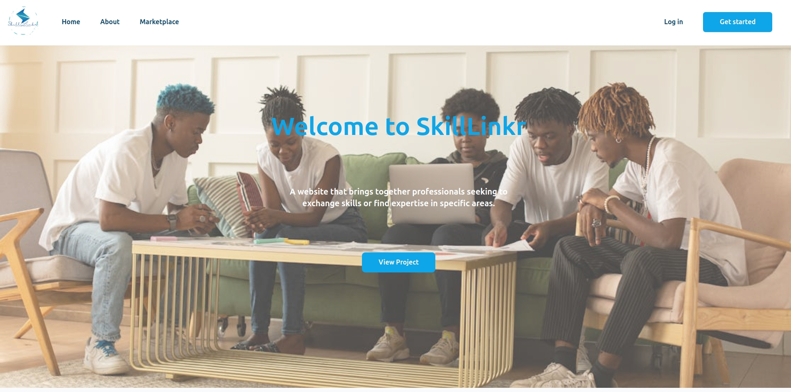

# SkillLinkr

## Introduction

**SkillLinkr** is a modern platform designed to bridge the gap between skills and opportunities, enabling professionals and businesses to connect and grow. Our platform focuses on delivering innovative solutions for professionals seeking to enhance their skills or businesses looking to hire skilled talent.

- **Deployed Site**: [Visit SkillLinkr](https://skilllinkr.ngarikev.tech)
- **Project Blog Article**: [SkillLinkr Project Blog](https://www.linkedin.com/pulse/skilllinkr-share-your-skills-unlock-opportunities-kelvin-mukaria-halqf)
- **Author(s)**:
  - [Kyenpya Gutap](https://www.linkedin.com/in/kyenpya-gutap-957538138)
  - [Kelvin Mukaria](https://www.linkedin.com/in/v3k)

## Screenshot



## Live Deployment

The SkillLinkr application is live and accessible at [https://skilllinkr.ngarikev.tech](https://skilllinkr.ngarikev.tech). Feel free to explore the platform and its features directly.

## Project Overview

SkillLinkr is built using a modern web architecture that separates the frontend and backend into distinct components.

**Frontend:**
Developed with React, the frontend provides a dynamic and responsive user interface. It utilizes React Router DOM for navigation, Tailwind CSS for styling, and Vite as the build tool.

**Backend:**
The backend is a Flask-based REST API, using Flask-SQLAlchemy for database interactions with an SQLite database. It handles user authentication, skill management, and real-time communication via Flask-SocketIO.

**Deployment:**
The application is containerized using Docker and deployed on AWS EC2, leveraging the AWS free tier. Caddy serves as a reverse proxy, handling HTTPS and load balancing.

## Installation

To run the project locally, follow these steps:

### Prerequisites

-   Node.js (v18 or higher)
-   npm (v8 or higher)
-   Python 3.x
-   pip (Python package installer)
-   Docker (optional, for containerized deployment)
-   Docker Compose (optional, for containerized deployment)

### Local Setup using Node.js and Python

1. **Clone the repository**:

    ```bash
    git clone https://github.com/ngari-kev/skilllinkr.git
    cd skilllinkr
    ```

2. **Frontend Setup**:

    -   Navigate to the `frontend` directory:

        ```bash
        cd frontend
        ```

    -   Install frontend dependencies:

        ```bash
        npm install
        ```

    -   Run the development server:

        ```bash
        npm run dev
        ```

    -   Open your browser and go to `http://localhost:5173` to view the app.

3. **Backend Setup**:

    -   Navigate to the `backend` directory:

        ```bash
        cd ../backend
        ```

    -   Create and activate a virtual environment (recommended):

        ```bash
        # Windows
        python -m venv venv
        venv\Scripts\activate

        # Linux/MacOS
        python3 -m venv venv
        source venv/bin/activate
        ```

    -   Install backend dependencies:

        ```bash
        pip install -r requirements.txt
        ```

    -   Create a `.env` file in the `backend` directory and configure your environment variables. You can use the provided `.env.example` as a template:
        ```env
        # Flask Environment Configuration
        FLASK_SECRET_KEY=your_secret_key_here
        FLASK_DEBUG=True
        FLASK_APP=main.py
        FLASK_SQLALCHEMY_DATABASE_URI=sqlite:///db.sqlite3
        FLASK_SQLALCHEMY_ECHO=True
        FLASK_JWT_SECRET_KEY=your_jwt_secret_key_here
        ```
        Replace `your_secret_key_here` and `your_jwt_secret_key_here` with secure random strings. You can generate these using the following Python code:
        ```python
        import secrets
        print(secrets.token_hex(24))
        ```
    -   Run the Flask application:

        ```bash
        python main.py
        ```

        The API will be available at `http://localhost:5000`.

### Local Setup using Docker

1. **Clone the repository**:

    ```bash
    git clone https://github.com/ngari-kev/skilllinkr.git
    cd skilllinkr
    ```

2. **Build and run the Docker containers**:

    ```bash
    docker compose up -d --build
    ```

    This command will build the Docker images for the frontend, backend, and Caddy, and start the containers in detached mode.

3. **Create Test Data (Backend)**
   You can populate your database with some test data by running the following command:
   ```bash
   docker compose run --rm backend python create_test_data.py
   ```

4. **Access the application**:

    -   The frontend will be accessible at `https://localhost` (served by Caddy with automatic HTTPS).
    -   The backend API will be accessible through Caddy at `https://localhost/api`.

## Usage

Once the project is set up, you can explore the following features:

-   **Marketplace:** Browse a list of professionals and their skills.
-   **Login and Signup:** Register or sign in to create your own profile.
-   **Profile Management:** Customize and manage your personal and professional profile.
-   **Search for Skills:** Use the search functionality to find specific talents.
-   **Chat:** Connect and communicate with other users in real-time via the integrated chat feature.

## Contributing

We welcome contributions from the community! Here's how you can get involved:

-   Fork the repository.
-   Create a new branch for your feature or bugfix.
-   Commit your changes and open a pull request.

## Related Projects

-   [LinkedIn](https://www.linkedin.com): SkillLinkr's mission and vision share similarities with LinkedIn's professional networking.
-   [Upwork](https://www.upwork.com): A freelance platform connecting skilled individuals with businesses.

## License

This project is licensed under the MIT License. See the [LICENSE](LICENSE) file for details.

## Contact

For any inquiries, please contact:
---

-   Author: Kelvin Mukaria
-   Email: kevngariwangui@gmail.com
-   LinkedIn: [Kelvin Mukaria](https://www.linkedin.com/in/v3k)
-   Location: Nairobi, Kenya

---

- Author: Kyenpya Gutap
- Email: kyenpyagutap@gmail.com
- LinkedIn: [Kyenpya Gutap](https://www.linkedin.com/in/kyenpya-gutap-957538138)
- Location: Lagos, Nigeria
